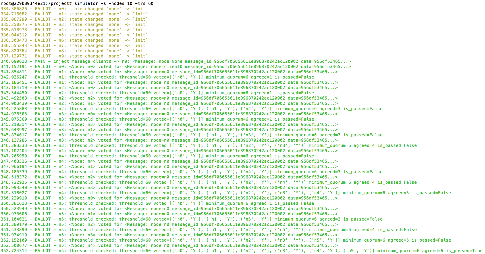

# Modified FBA Implementation and Simulation

The FBA(Federated Byzantine Agreement) consensus protocol is the way to make agreement between untrusted network nodes. The well-known implementation of FBA in real world is the stellar blockchain network, which has the derived consensus, they called 'SCP'(Stellar Consensus Protocol).

This implementation will help to understand how the agreement is made in FBA and you can simply adjust the quorum size and threshold. Most of the concept and names was derived from SCP and FBA traditions. The more detailed information about FBA and SCP, you can simple find at the https://stellar.org and google. :)

## Installation

At first, start and log into docker container.

```
$ yarn start
$ yarn bash
```

Done!

## Run

Simple usage

```
$ simulator -h
usage: simulator [-h] [-s] [-nodes NODES] [-trs TRS]

optional arguments:
  -h, --help    show this help message and exit
  -s            turn off the debug messages
  -nodes NODES  number of validator nodes in the same quorum; default 4
  -trs TRS      threshold; 0 < trs <= 100
```

Run

```
$ simulator -s
```

> You can omit the `-s` option, you will see the more detailed debug messages.

The number of nodes(validators) can be set, by default, 4.

```
$ simulator -s -nodes 10
```

And 'threshold' value also can be set

```
$ simulator -s -nodes 10 -trs 60
```

The result is as following  


